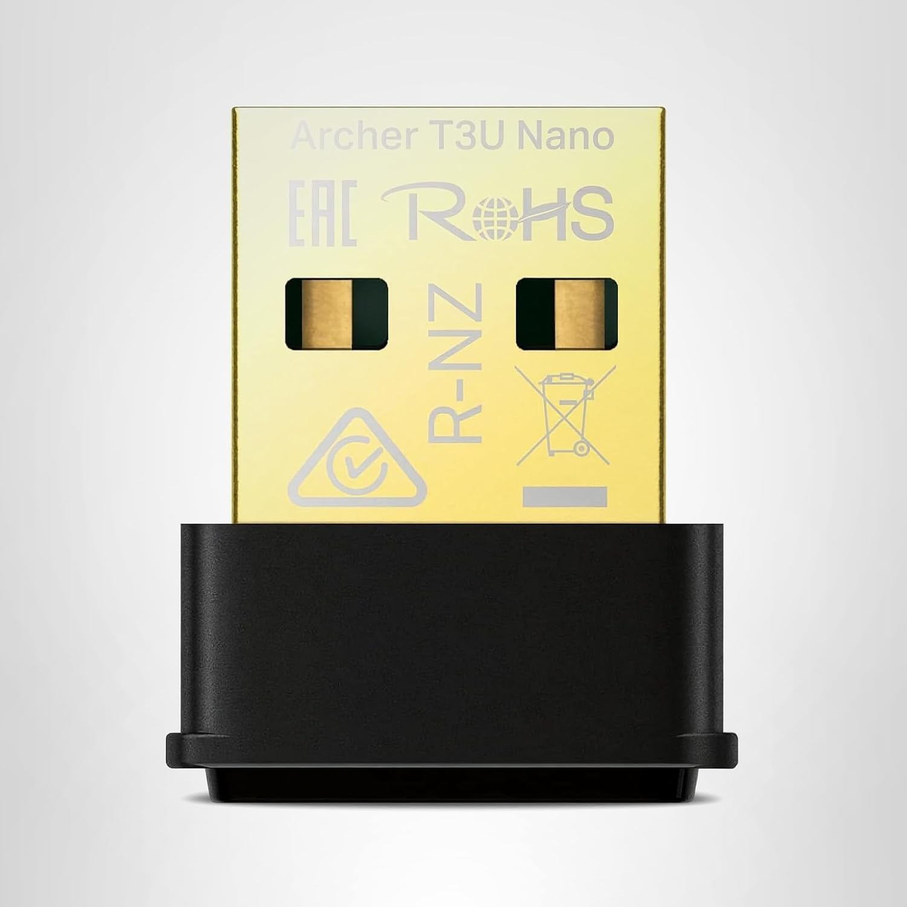
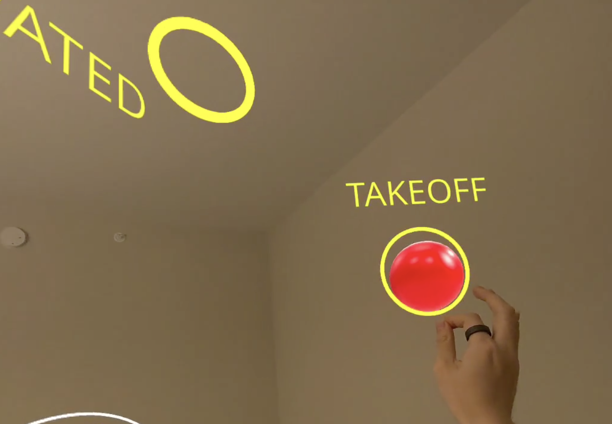
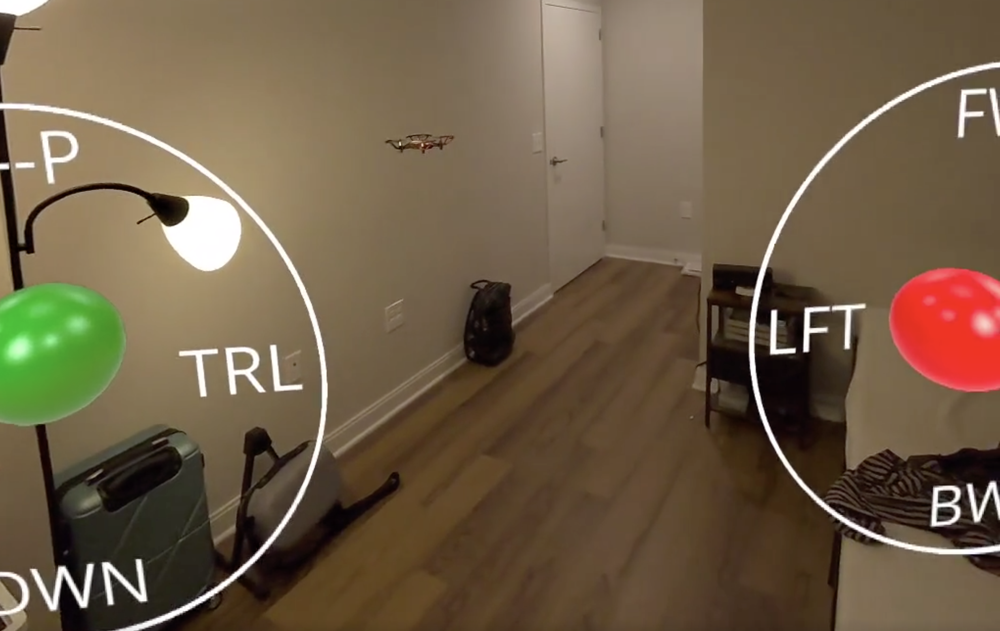
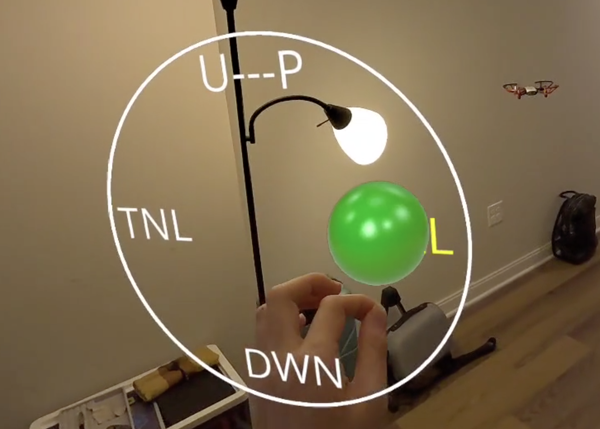
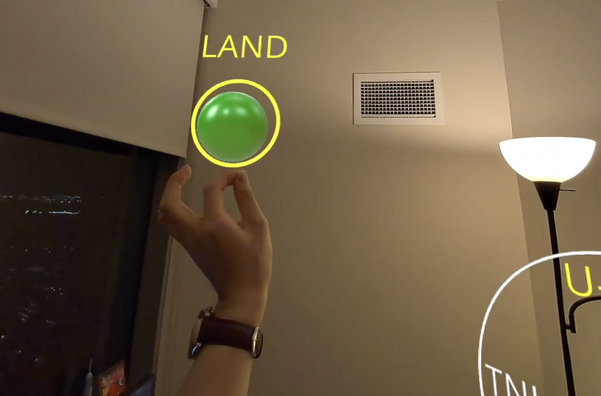

<p align="center">
    
</p>

# Augmented Reality Tello Drone Simulator
This is a web-based XR program that enables user to controll DJI Tello Drone with hands or headset controller.

## Preparation

**Hardware**:
   - XR Headset that supports web browser (I tested with Meta Quest 3)


   <figure style="text-align: center;">
      
      <figcaption>Meta Quest 3</figcaption>
      </figure>

   - External WiFi Adapter that enables network connection between computer server and drone (I bought TP-Link Nano USB WiFi Adapter)

   <figure style="text-align: center;">
      
      <figcaption>TP-Link Archer T3U Nano</figcaption>
      </figure>

   - Computer that runs on either Linux or Windows 10/11


## Set Up Local Environment

To prepare your development environment and get started with building your WebXR experience, follow the steps below:

1. **Clone this repository**:

   ```bash
   git clone https://github.com/RayChen666/AR-Tello-Simulator.git
   ```

2. **Verify that you have Node.js and npm installed**:

   ```bash
   node -v
   npm -v
   ```

3. **Install dependencies**:

   ```bash
   npm install
   ```

4. **Run the local backend server**:

   ```bash
   npm run dev
   ```

5. **Run the WebXR frontend**:
   ```bash
   npm run start-server
   ```

6. **Or run concurrently**:
   ```bash
   npm run dev-full
   ```

7. **Check your local IP address**:
   ```bash
   ifconfig | grep "inet " | grep -v 127.0.0.1
   ```

   After running the above command, your server will be available at `localhost:8081`.
   If you want to access the program on headset browser, go `your-ip-address:8081`.

## Install Immersive Web Emulator extension
Navigate to: https://chromewebstore.google.com/detail/immersive-web-emulator/cgffilbpcibhmcfbgggfhfolhkfbhmik?hl=en&pli=1 to install the extension for your Chrome browser.

## How to play
- Navigate to: https://github.com/RayChen666/AR-Tello-Simulator/blob/main/video.MP4 to download the DEMO video 

- Navigate to: https://youtube.com/shorts/ERtzd-qVtxw to see the Youtube shorts

## Screenshots
<p align="center">
    
</p>
<p align="center">
    
</p>
<p align="center">
    
</p>
<p align="center">
    
</p>


